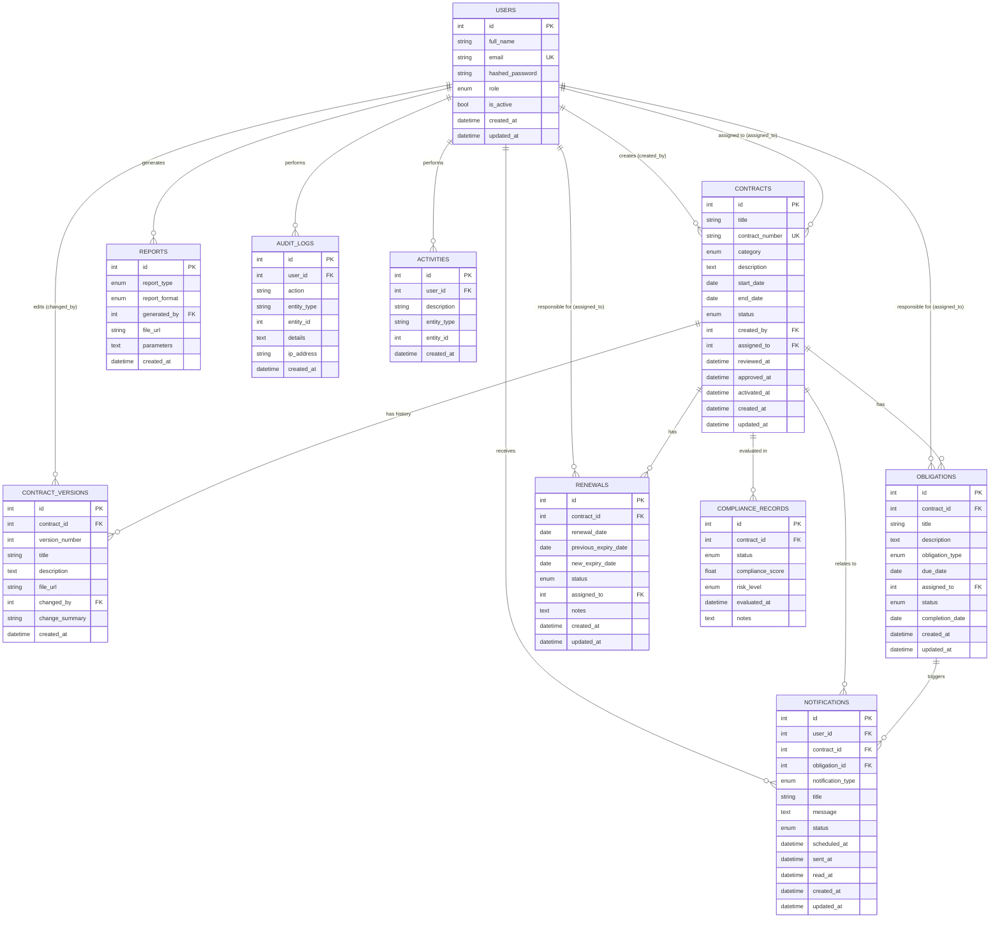

# ContractIQ — Database Design Document (Sprint 3)

## 1. Overview

This document defines the database schema for **ContractIQ**, covering all
nine core tables identified in the project brief: `users`, `contracts`,
`contract_versions`, `obligations`, `renewals`, `notifications`, `reports`,
`audit_logs`, and `activities`. The schema is implemented in
`app/models/*.py` using SQLAlchemy and versioned with Alembic.

## 2. Entity Relationship Diagram

> Note: `compliance_records` was added during implementation (Sprint 11) as
> the store for historical compliance evaluations. It was not in the
> original nine-table list but follows the same design conventions and is
> included here for completeness — see section 5.

## 3. Table-by-Table Design

### 3.1 `users`
| Column | Type | Constraints | Purpose |
|---|---|---|---|
| id | INTEGER | PK | Unique user identifier |
| full_name | VARCHAR(150) | NOT NULL | Display name |
| email | VARCHAR(150) | UNIQUE, NOT NULL | Login identifier |
| hashed_password | VARCHAR(255) | NOT NULL | Bcrypt hash, never plaintext |
| role | ENUM | NOT NULL | One of the 6 ContractIQ roles |
| is_active | BOOLEAN | NOT NULL, default true | Soft-disable a user without deleting |
| created_at / updated_at | TIMESTAMP | server default now() | Audit timestamps |

**Purpose:** Central identity table. Every other table's ownership,
assignment, and audit trail traces back to a `users.id`.

### 3.2 `contracts`
Holds the master record for each contract. **PK:** `id`. **FKs:**
`created_by → users.id`, `assigned_to → users.id`. Enforces
`contract_number` uniqueness and a `status` enum constrained to the
Draft → Under Review → Approved → Active → Expired/Terminated lifecycle.

**Purpose:** The Contract Repository's single source of truth for contract
metadata, ownership, and lifecycle state.

### 3.3 `contract_versions`
**PK:** `id`. **FKs:** `contract_id → contracts.id`, `changed_by → users.id`.
One-to-Many from `contracts`: a contract accumulates a version row every
time it is materially edited, enabling version history / rollback and
supporting the "Document Version Control" module in the project brief.

### 3.4 `obligations`
**PK:** `id`. **FKs:** `contract_id → contracts.id`, `assigned_to → users.id`.
One-to-Many from `contracts` (a contract has many obligations) and
Many-to-One to `users` (a user can be assigned many obligations).

**Purpose:** Tracks the concrete responsibilities/deadlines a contract
creates — the core of the "Obligation Tracking" module.

### 3.5 `renewals`
**PK:** `id`. **FKs:** `contract_id → contracts.id`, `assigned_to → users.id`.
One-to-Many from `contracts`: a contract can have multiple renewal events
over its lifetime, preserving full renewal history.

### 3.6 `notifications`
**PK:** `id`. **FKs:** `user_id → users.id` (required), `contract_id →
contracts.id` (optional), `obligation_id → obligations.id` (optional).
A notification always belongs to exactly one recipient user but may or may
not relate to a specific contract/obligation — both FKs are nullable to
support general system alerts.

### 3.7 `reports`
**PK:** `id`. **FK:** `generated_by → users.id`. Stores metadata (type,
format, generating user, output location) for generated PDF/Excel reports
rather than the binary file itself.

### 3.8 `audit_logs`
**PK:** `id`. **FK:** `user_id → users.id` (nullable, to allow logging
system-initiated events). Immutable, append-only security/compliance trail
(logins, approvals, role changes, deletions).

### 3.9 `activities`
**PK:** `id`. **FK:** `user_id → users.id`. Lightweight, user-facing feed
(distinct from the audit log) that powers the "Recent Activities" dashboard
widget.

### 3.10 `compliance_records` (implementation addition, Sprint 11)
**PK:** `id`. **FK:** `contract_id → contracts.id`. Stores a timestamped
snapshot each time a contract's compliance is (re-)evaluated, so compliance
history is retained for audit and reporting even though the *live* status
can also be recomputed on demand from `obligations`.

## 4. Relationship Summary

| Relationship | Cardinality |
|---|---|
| users → contracts (creator) | One-to-Many |
| users → contracts (assignee) | One-to-Many |
| contracts → contract_versions | One-to-Many |
| contracts → obligations | One-to-Many |
| users → obligations (assignee) | One-to-Many |
| contracts → renewals | One-to-Many |
| users → renewals (assignee) | One-to-Many |
| users → notifications | One-to-Many |
| contracts → notifications | One-to-Many (optional) |
| obligations → notifications | One-to-Many (optional) |
| users → reports | One-to-Many |
| users → audit_logs | One-to-Many |
| users → activities | One-to-Many |
| contracts → compliance_records | One-to-Many |

There are no Many-to-Many relationships in this design — every association
in ContractIQ is naturally expressed as ownership/assignment, which resolves
cleanly to One-to-Many via foreign keys.

## 5. How the Tables Work Together

A `contract` sits at the center of the schema. It is created by a `user`
(and optionally assigned to another), and it is progressively enriched as
the platform's other modules operate on it: `contract_versions` capture its
edit history, `obligations` capture the concrete deliverables and deadlines
it creates, and `renewals` capture the negotiation events around its expiry.
The `compliance_records` table derives a point-in-time health snapshot from
the current state of a contract's `obligations` (percentage completed,
number overdue) so managers can see, at a glance, whether a contract is on
track. All of this activity — status changes, approvals, deletions — is
mirrored into `audit_logs` for security/compliance traceability, while a
lighter-weight `activities` feed powers day-to-day dashboards.

The `notifications` table is the glue that turns passive data into
proactive alerts: when an obligation nears its due date, a renewal
approaches expiry, or a compliance evaluation flags a contract as high
risk, a notification row is created for the relevant `user` and (optionally)
emailed via SMTP. Finally, `reports` records metadata about exported
PDF/Excel summaries so that report generation history is itself auditable.
Together these tables let ContractIQ answer its central business question —
*"are our contractual obligations being met, and who needs to act next?"* —
without any table duplicating data that another table already owns.
