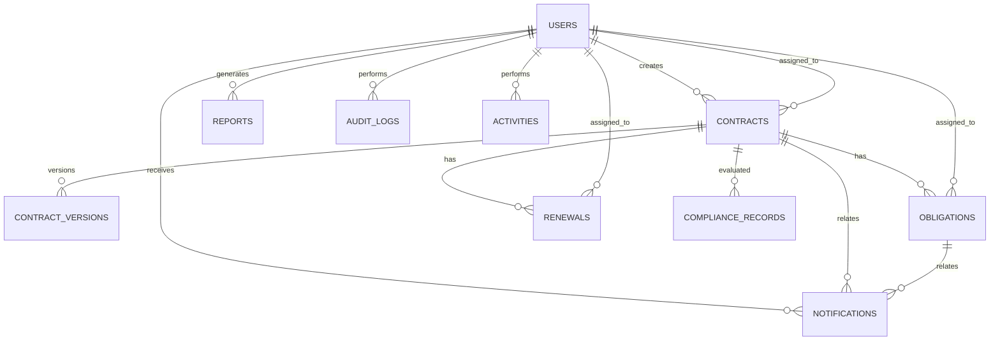

# ContractIQ ER Diagram

The core relationship is `users -> contracts -> obligations/renewals`, with notifications, compliance history, reports, audit logs and activities supporting the operational modules.
